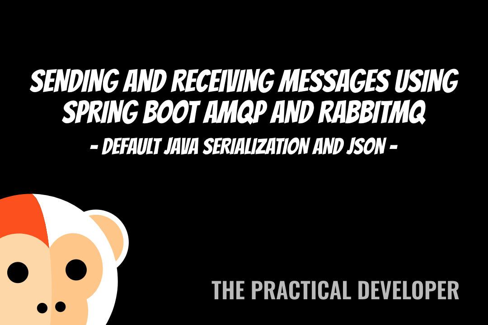

# Spring Boot 2 and RabbitMQ JSON configuration

Simple Spring Boot 2 app that demonstrates how to use JSON serialization with RabbitMQ.

This is the source code used in the video Sending and Receiving messages using Spring Boot AMQP and RabbitMQ, available on [Youtube](https://www.youtube.com/watch?v=yuApTF_HeWM).

